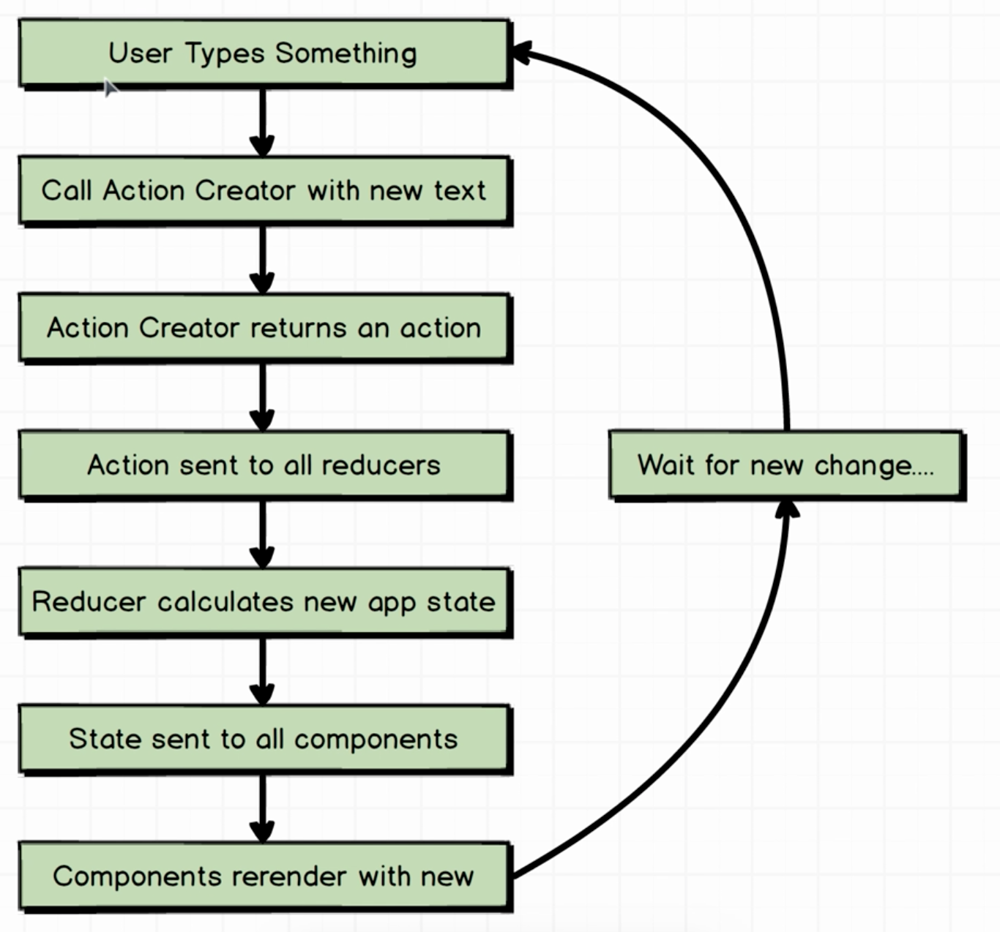
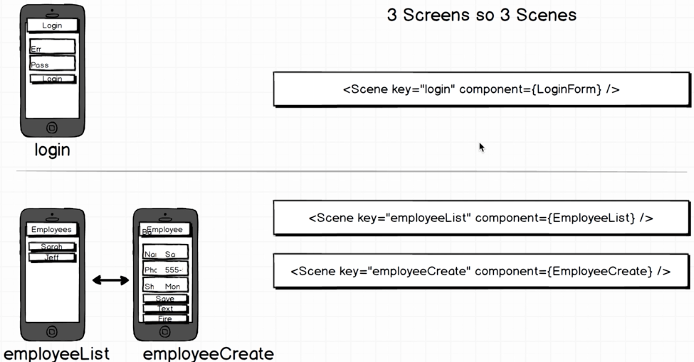

Manager is a library component to demonstrate navigation with React and Redux.  It uses the common folder of components already created.

SCHEDULER:  A manager can select employees and designate tasks to them.
  *Login
  *List - employees
  *Container - employee; create, edit and remove(fire)

img/Screen Shot 2017-10-30 at 14.47.15.png

Login Form Using Redux - previous component was React only

Using Redux Action Creators to handle login data

Scenes

